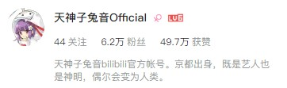

## 地方广电

><iframe src="https://region-zhejiang-resource.xuexi.cn/video/1006/p/f688b2ce52a5f5ebf88c46737c8dbb27-e21874a857654dd08ee8187f87224954-2.mp4" scrolling="no" border="0" frameborder="no" framespacing="0" allowfullscreen="true" muted width="256px" height="144px" > </iframe>
>
>[最想去的地方丨唐先十景](https://article.xuexi.cn/articles/index.html?art_id=2540781970828240651&cdn=https%3A%2F%2Fregion-zhejiang-resource)  
>学习强国

><iframe src="//player.bilibili.com/player.html?aid=656320993&bvid=BV1Na4y1g7sd&cid=1135363021&page=1" scrolling="no" border="0" frameborder="no" framespacing="0" allowfullscreen="true" width="256px" height="144px"> </iframe>
>
>[民生|《金东20年》文丛首发，主播带你走读金东，感受民生变化…](/)  
>微信视频号

## 短视频

>
><iframe src="//player.bilibili.com/player.html?aid=868941241&bvid=BV1BV4y167Mp&cid=1136752961&page=1" scrolling="no" border="0" frameborder="no" framespacing="0" allowfullscreen="true" width="256px" height="144px"> </iframe>
>[文旅短视频](/)

>[防晒衣测评](https://v.douyin.com/U6q9wMA/)  
>抖音

## ZOU

><iframe src="//player.bilibili.com/player.html?aid=783799803&bvid=BV1M24y1T7C9&cid=1135363458&page=1" scrolling="no" border="0" frameborder="no" framespacing="0" allowfullscreen="true" width="256px" height="144px"> </iframe>
>
>[阳光下的“第一抹美味”](https://v.douyin.com/U6Xookg/)  
>抖音/微信视频号

><iframe src="//player.bilibili.com/player.html?aid=656276355&bvid=BV1ra4y1u74b&cid=1135362971&page=1" scrolling="no" border="0" frameborder="no" framespacing="0" allowfullscreen="true" width="256px" height="144px"> </iframe>
>
>[[歌曲MV]我的二十岁遇到党的二十大](https://v.douyin.com/U6XFXV9/)  
>抖音/微信视频号

><iframe src="//player.bilibili.com/player.html?aid=911324568&bvid=BV18M4y1q73D&cid=1135362701&page=1" scrolling="no" border="0" frameborder="no" framespacing="0" allowfullscreen="true" width="256px" height="144px"> </iframe>
>
>[[MV制片]如果青春有颜色，那一定是“我爱你，中国”](/)  
>微信视频号

><iframe src="//player.bilibili.com/player.html?aid=826332703&bvid=BV1zg4y1F7Kj&cid=1135363938&page=1" scrolling="no" border="0" frameborder="no" framespacing="0" allowfullscreen="true" width="144px" height="256px"> </iframe>
>
>[[舞蹈MV]迎接北京冬奥会《一起向未来》](https://v.douyin.com/U646BqW/)  
>抖音/微信视频号

><iframe src="//player.bilibili.com/player.html?aid=656267412&bvid=BV1Ba4y1u72D&cid=1135363399&page=1" scrolling="no" border="0" frameborder="no" framespacing="0" allowfullscreen="true" width="256px" height="144px"> </iframe>
>
>[[连续运镜]拜年啦！](https://v.douyin.com/U6Vuhf1/)  
>抖音/微信视频号

><iframe src="//player.bilibili.com/player.html?aid=698828625&bvid=BV1em4y187as&cid=1135364104&page=1" scrolling="no" border="0" frameborder="no" framespacing="0" allowfullscreen="true" width="256px" height="144px"> </iframe>
>
>[[混剪+动效修改]毕业季 向前买进吧！](https://v.douyin.com/U6VoCVe/)  
>抖音/微信视频号

---

## 字幕组

>**天神子兔音字幕组** —— [*天神子兔音Official*](https://space.bilibili.com/360221708/) 
>副管理 片源 时轴 AE特效还原 
>

><iframe src="//player.bilibili.com/player.html?aid=838386424&bvid=BV1eg4y1i7VH&cid=199693116&page=1" scrolling="no" border="0" frameborder="no" framespacing="0" allowfullscreen="true" width="256px" height="144px"> </iframe>
>
>[【翻唱】lemon ／ 米津玄師【Kotone(天神子兔音)cover】](https://www.bilibili.com/video/BV1eg4y1i7VH/)

><iframe src="//player.bilibili.com/player.html?aid=753535637&bvid=BV18k4y1z7dh&cid=204259437&page=1" scrolling="no" border="0" frameborder="no" framespacing="0" allowfullscreen="true" width="256px" height="144px"> </iframe>
>
>[【翻唱】花上的亡灵 ／ ヨルシカ【Kotone(天神子兔音)cover】](https://www.bilibili.com/video/BV18k4y1z7dh/)

><iframe src="//player.bilibili.com/player.html?aid=796185543&bvid=BV16C4y187Fs&cid=206853318&page=1" scrolling="no" border="0" frameborder="no" framespacing="0" allowfullscreen="true" width="256px" height="144px"> </iframe>
>
>[【翻唱】No Doubt ／ Official髭男dism【Kotone(天神子兔音)cover】](https://www.bilibili.com/video/BV16C4y187Fs/)

><iframe src="//player.bilibili.com/player.html?aid=498659298&bvid=BV1BK411n7mx&cid=209114840&page=1" scrolling="no" border="0" frameborder="no" framespacing="0" allowfullscreen="true" width="256px" height="144px"> </iframe>
>
>[【翻唱】Hello／How are you ／ ナノウ【Kotone(天神子兔音)cover】](https://www.bilibili.com/video/BV1BK411n7mx/)
